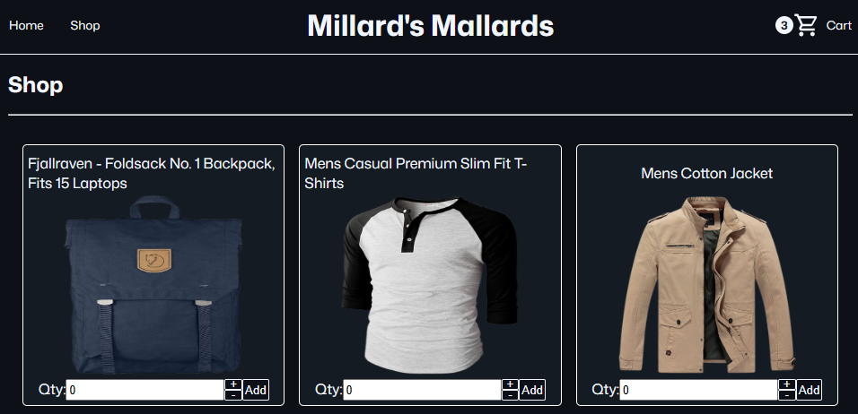
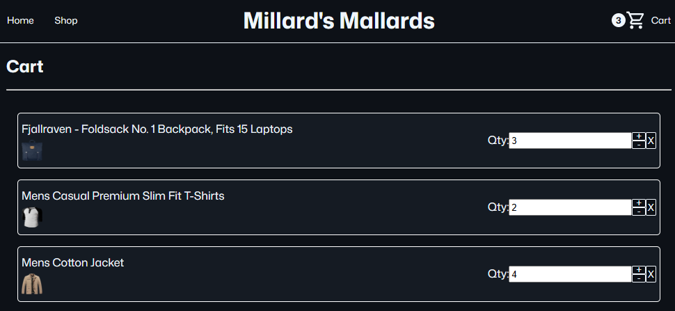

# Shopping Cart

A small online storefront, where users can browse products, add items to a cart, adjust quantities, and view their selected items.

**Live site:** https://nickwortho-millardsmallards.netlify.app/ \
**Repository:** https://github.com/nickwortho/shopping-cart

## Screenshots

### Shop Page

<kbd>

</kbd>

### Cart Page

<kbd>
    
</kbd>

## Features

* Product data fetched from the [FakeStore API](https://fakestoreapi.com/)
* Multi-page routing with React Router
* Home, shop, cart, and error pages
* Shop page displaying fetched product cards
* Quantity controls for adding products to the cart
* Cart page showing selected products and quantities
* Ability to increase, decrease, or remove cart items
* Cart quantity indicator in the navigation bar
* Loading and fetch-error states
* Component-scoped styling with CSS modules

## Built With

* React
* React Router
* Vite
* CSS Modules
* Vitest
* React Testing Library
* FakeStore API

## Getting Started

To run the project locally:

```bash
git clone https://github.com/nickwortho/shopping-cart.git
cd shopping-cart
npm install
npm run dev
```

Then open the local development URL shown in your terminal.

## Available Scripts

```bash
npm run dev
```
Starts the Vite development server.

```bash
npm run build
```

Builds the app for production.

```bash
npm run preview
```

Previews the production build locally.

```bash
npm run lint
```

Runs ESLint across the project.

```bash
npm run test
```

Runs the test suite with Vitest.

## Credits

Product data is provided by [FakeStore API](https://fakestoreapi.com/).

Icons are sourced from [Material Design Icons by Google](https://github.com/google/material-design-icons).
